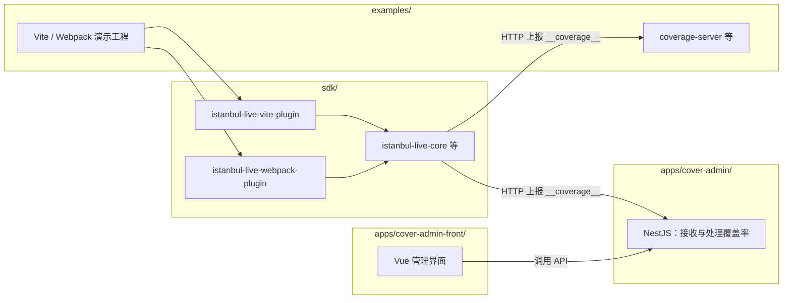

# cover-code 模块关系说明

本文档说明 monorepo 内各目录的职责，以及它们之间如何配合。

## 总览

（演示里也可能把数据发到 `examples` 自带的接收服务；上图为常见分工。）

---

## `sdk/`

**作用：** 浏览器端 Istanbul 插桩与**覆盖率信息上报**相关代码，供业务工程集成。

| 包 | 说明 |
|----|------|
| `istanbul-live-vite-plugin` | 基于 Vite（`vite-plugin-istanbul` 等）的插桩与上报 |
| `istanbul-live-webpack-plugin` | 基于 Webpack（`webpack-plugin-istanbul` 等）的插桩与上报 |
| `istanbul-live-core` | 上报脚本、共用逻辑等 |
| `istanbul-live-babel` | Babel / `babel-plugin-istanbul` 等可复用插桩辅助（包名避免与 `istanbul-lib-instrument` 冲突） |

**关系：** 被 **examples** 与各业务前端通过 `workspace:*` 或发布后 npm 依赖引用；构建产物在浏览器中周期性把 `window.__coverage__` 等以 HTTP POST 发到**你配置的接收地址**（可以是 examples 里的 demo 服务，也可以是 **apps/cover-admin**）。

---

## `examples/`

**作用：** 用来**联调、验证 `sdk/` 里插件**的示例工程（Vite、Webpack、React/Vue 等）以及简易接收端（如 `coverage-server-demo`）。

**关系：**

- 依赖 `sdk/` 中的 `istanbul-live-*` 包（workspace）。
- 用于本地开发、回归插件行为；**不是**管理端产品代码。

---

## `apps/cover-admin/`

**作用：** **接收并处理**插件（`sdk`）从浏览器上报的覆盖率数据（合并、`istanbul-lib-source-maps` 映射、汇总接口等，以项目内实际实现为准）。

**关系：**

- 作为**后端服务**：对上提供 HTTP API，供浏览器插件上报、供管理前端查询与操作。
- 与 `examples` 中 demo 接收端是**不同应用**；业务上可把上报 endpoint 配到本服务。

---

## `apps/cover-admin-front/`

**作用：** **apps/cover-admin** 的**管理端前端**（Vue + Vite 等），用于展示与操作覆盖率相关能力。

**关系：**

- 通过 HTTP 调用 **apps/cover-admin** 暴露的 API。
- **不**直接依赖 `sdk`；与插件的关系是「用户先在业务项目里集成 sdk → 数据打到 cover-admin → 本前端消费 cover-admin 的接口」。

---

## 数据流（概念）

1. 业务或 **examples** 在构建/开发时启用 `sdk` 插件 → 浏览器内产生覆盖率数据。
2. 插件按配置将数据 **POST** 到接收服务（例如 **cover-admin** 或 examples 内 demo）。
3. **cover-admin** 持久化或计算后，由 **cover-admin-front** 调用 API 展示与管理。

---

## 根目录脚本速查

| 脚本 | 典型用途 |
|------|----------|
| `pnpm run dev:vite` / `dev:webpack` 等 | 跑 examples 里对应 demo |
| `pnpm run receiver` | 跑 examples 里覆盖率接收 demo |
| `pnpm run dev:server` | 跑 **cover-admin** 后端 |
| `pnpm run dev:admin` | 跑 **cover-admin-front** |

更完整的命令见仓库根目录 `README.md`。
